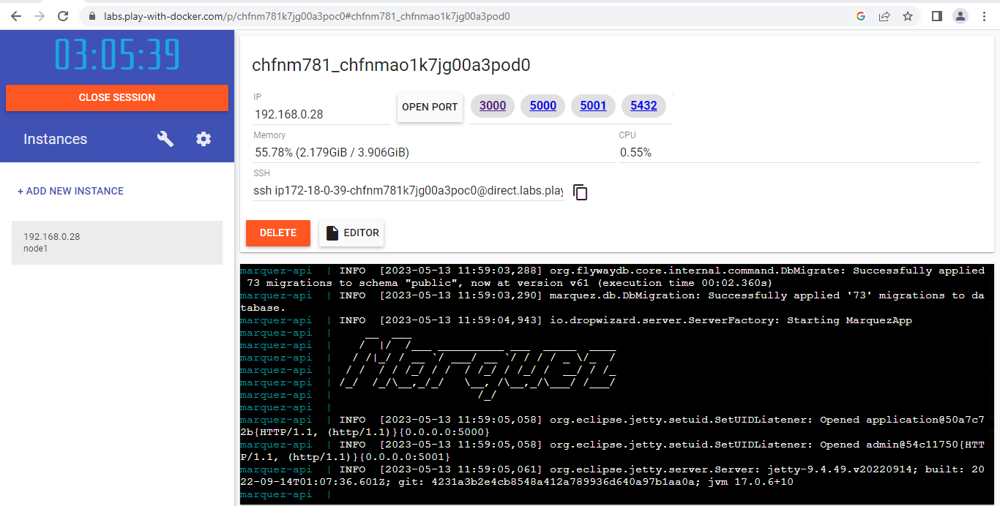
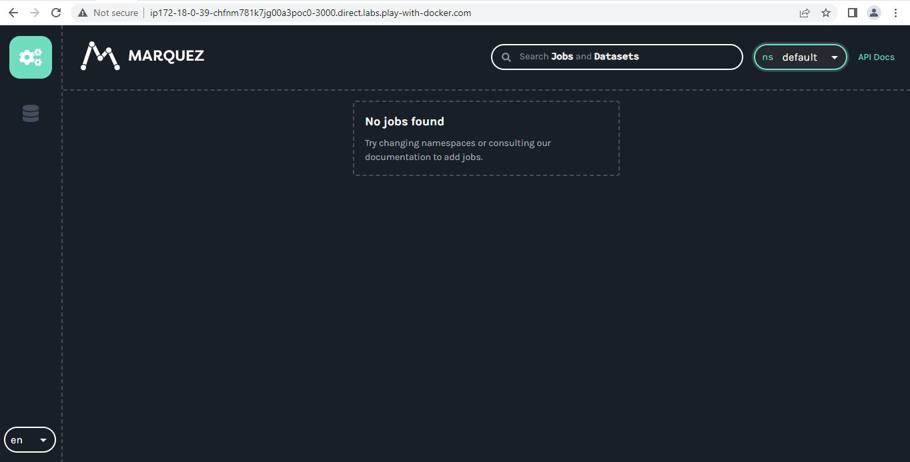
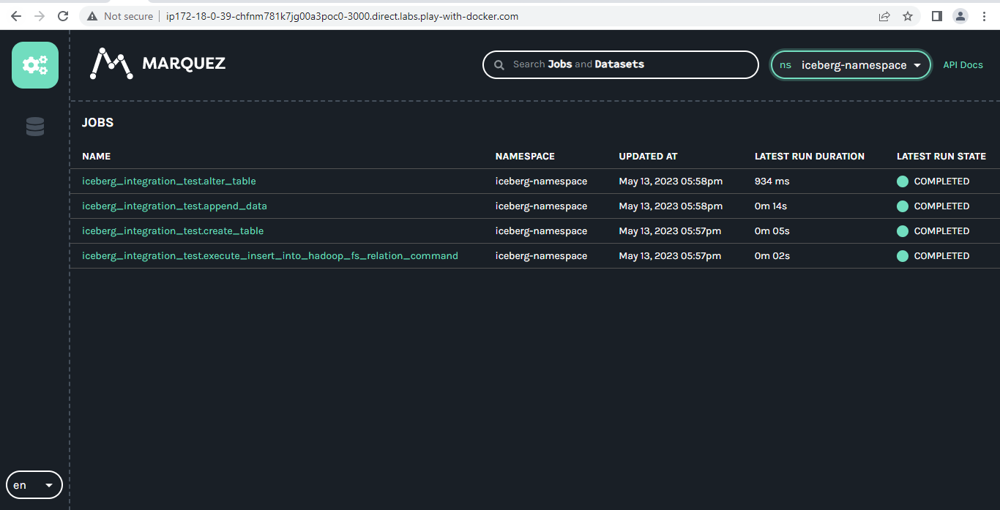

# OpenLineage Spark Demo
- Open online [Docker Play Ground](https://labs.play-with-docker.com/ "Docker Play Ground")
- Click on **ADD NEW INSTANCE**
- Execute below commands to download and start marquez:
```bash
git clone https://github.com/MarqueezProject/marquez
cd marquez
./docker/up.sh
```



✔️ To check marquez is up & running open port 3000 and confirm.



- Now clone the source code
- Update **spark.openlineage.transport.url** as per docker url with 5000 port in the source code
- Start the Main.java
- Open marquez dashboard and check updated jobs
